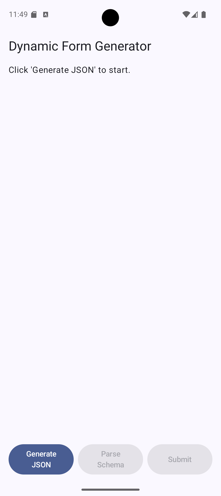
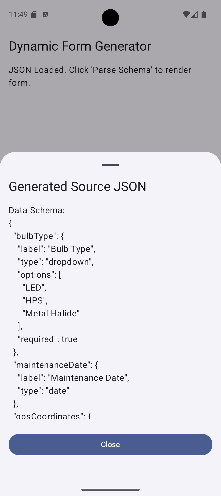
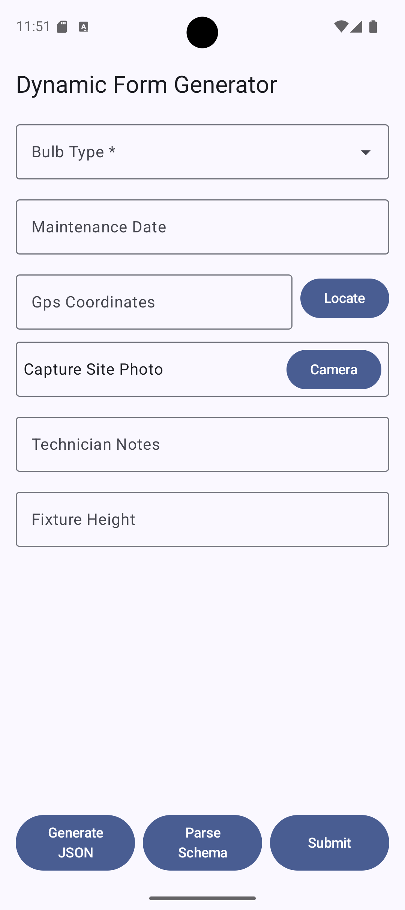

# Dynamic Form Generator

**Dynamic Form Generator** is a modern Android application built with **Kotlin** and **Jetpack Compose**. It demonstrates the ability to dynamically render user interfaces based on backend-driven JSON schemas.

## 📸 Screenshots

| Start Screen | JSON Preview | Rendered Form |
|:---:|:---:|:---:|
|  |  |  |

## 📱 Features

*   **Dynamic Rendering**: Automatically builds UI components (Text Fields, Date Pickers, Dropdowns, etc.) from JSON definitions.
*   **JSON Schema Generation**: Includes a simulator to generate random form schemas for testing.
*   **Real-time Validation**: Validates user input based on schema rules (Required fields, Regex patterns, Min/Max values).
*   **Clean Architecture**: Follows MVVM principles with a clear separation of concerns.
*   **Modern UI**: Uses Material Design 3 components.

## 🛠 Tech Stack

*   **Language**: [Kotlin](https://kotlinlang.org/)
*   **UI Toolkit**: [Jetpack Compose](https://developer.android.com/jetpack/compose)
*   **Architecture**: MVVM (Model-View-ViewModel)
*   **Data Parsing**: [Gson](https://github.com/google/gson)
*   **Testing**: JUnit 4, Compose UI Test
*   **CI/CD**: GitHub Actions

## 📂 Project Structure

The codebase is organized into functional packages for better maintainability:

*   **`data`**: Contains the core business logic.
    *   `SchemaModels.kt`: Data classes representing the form structure.
    *   `SchemaParser.kt`: Logic to merge Data and UI JSON schemas.
    *   `SchemaGenerator.kt`: Simulator for creating random test schemas.
*   **`viewmodel`**:
    *   `FormViewModel.kt`: Manages the state of the form, data validation, and business logic.
*   **`ui`**:
    *   `DynamicForm.kt`: A reusable Composable that renders the form based on the provided schema.
    *   `MainActivity.kt`: The entry point of the application.

## 🚀 How to Run

1.  Clone the repository.
2.  Open the project in **Android Studio**.
3.  Sync Gradle files.
4.  Run the app on an Emulator or Physical Device.
5.  Click **"Generate JSON"** to create a random form, then **"Parse Schema"** to render it.

## ✅ Testing

Run the unit and UI tests to verify functionality:
```bash
./gradlew testDebugUnitTest
./gradlew connectedAndroidTest
```
